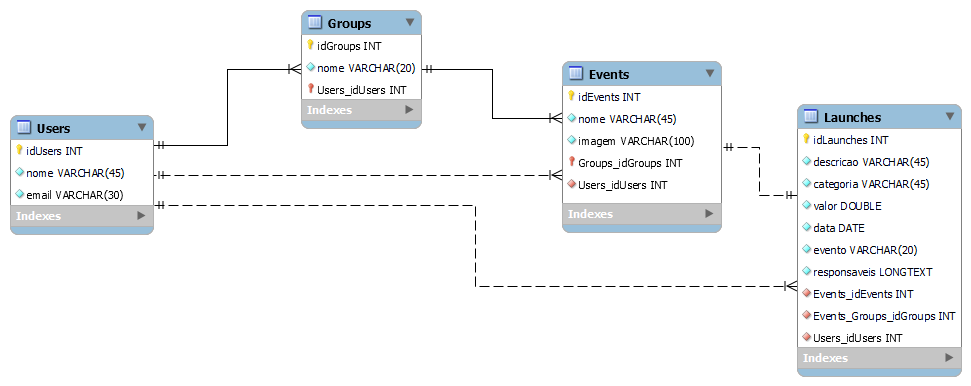

### 1.1. Modelo de dados

<h4>Entidades</h4>

- **Users**: Tabela responsável por armazenas os dados dos usuarios cafastrados na DivideUai.
- **Grupos**: Tabela responsavel por armazenas os grupos (Individual e Compartilhado).
- **Eventos**: Tabela resposnavel por armazenar eventos criados dentro de cada grupo.
- **Lancamentos**: Tabela responsável por armazenar os lançamentos feitos em cada evento.

<h4>Relacionamentos</h4>
 
- **Users e Groups**: Um usuário pode estar associado a zero ou mais grupos. 
- **Users e Groups**: Um grupo pode ter zero ou mais eventos; um evento pertence a exatamente um grupo.
- **Users e Events**: Um usuário pode criar zero ou mais eventos; um evento é criado por exatamente um usuário.
- **Events e Launches**: Um evento pode ter, no máximo, um lançamento associado e cada lançamento está associado a exatamente um evento.

### 1.2. Tecnologias

<h4>Camada de Apresentação</h4>

- **Tecnologias**: ReactJS, JavaScript.
- **Descrição**: Esta camada lida com a interface do usuário (UI) do sistema. O ReactJS é usado para criar interfaces de usuário responsivas e dinâmicas.

<h4>Camada de Lógica de Negócios</h4>

- **Tecnologias**: .NET, C#, Entity Framework, JUnit.
- **Descrição**: A camada de lógica de negócios é responsável por processar as solicitações dos clientes, aplicar regras de negócios e interagir com a camada de persistência para acessar e manipular os dados. O .NET é utilizado como o framework de desenvolvimento para criar APIs RESTful e gerenciar a lógica de negócios. O Entity Framework é usado para mapear objetos Java para o banco de dados Microsoft SQL Server. Testes unitários são realizados com JUnit para garantir a qualidade do código.

<h4>Camada de Persistência</h4>

- **Tecnologias**: Microsoft SQL Server.
- **Descrição**: Esta camada trata do armazenamento e recuperação de dados. O Microsoft SQL Server é o banco de dados relacional usado para armazenar informações sobre clientes, lançamentos, históricos de lançamentos, grupos, eventos e muito mais.

<h4>Outras Tecnologias</h4>

- **Log do Sistema**: Log4J é usado para registro de atividades e depuração do sistema.
- **Deploy**: O sistema é implantado em GitHub Pages para permitir o acesso a partir de um ambiente web.
- **IDEs de Desenvolvimento**: Rider IDEA é usado para desenvolvimento backend, enquanto o Visual Studio Code é usado para desenvolvimento frontend.
- **Requisições**: Swagger é uma ferramenta para testar APIs e simular solicitações feitas ao sistema
